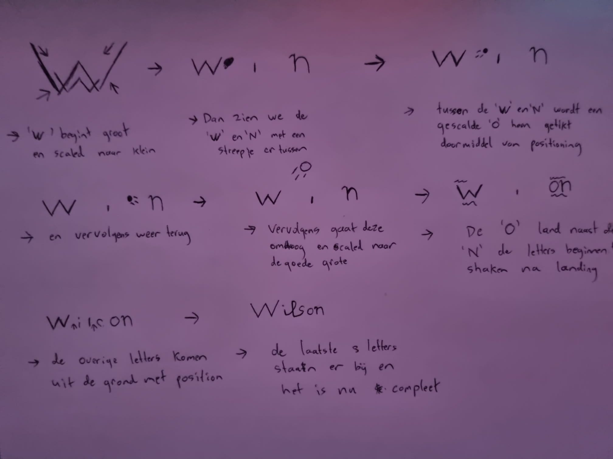
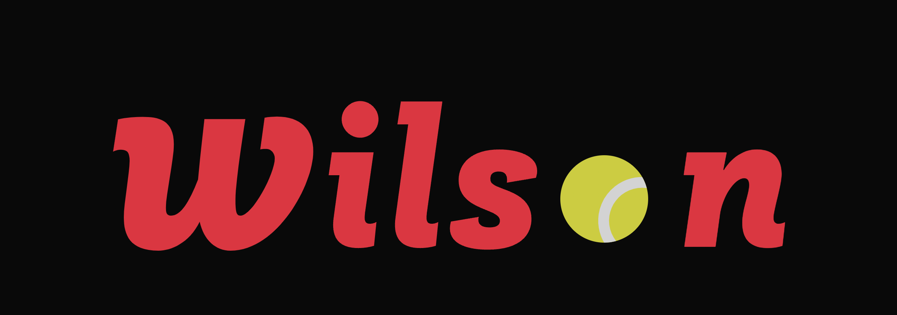
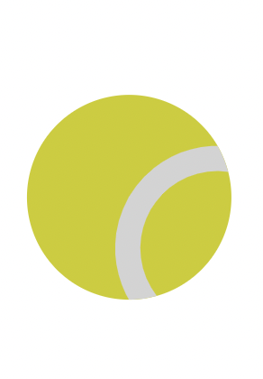
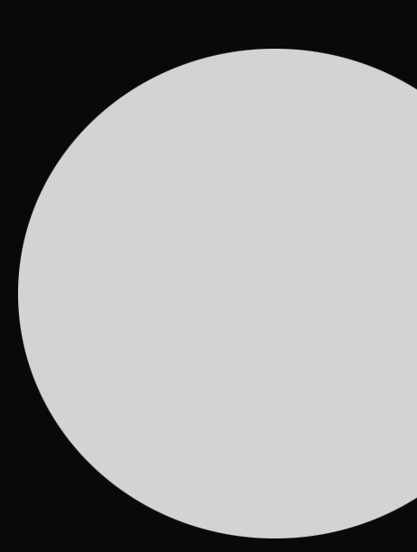
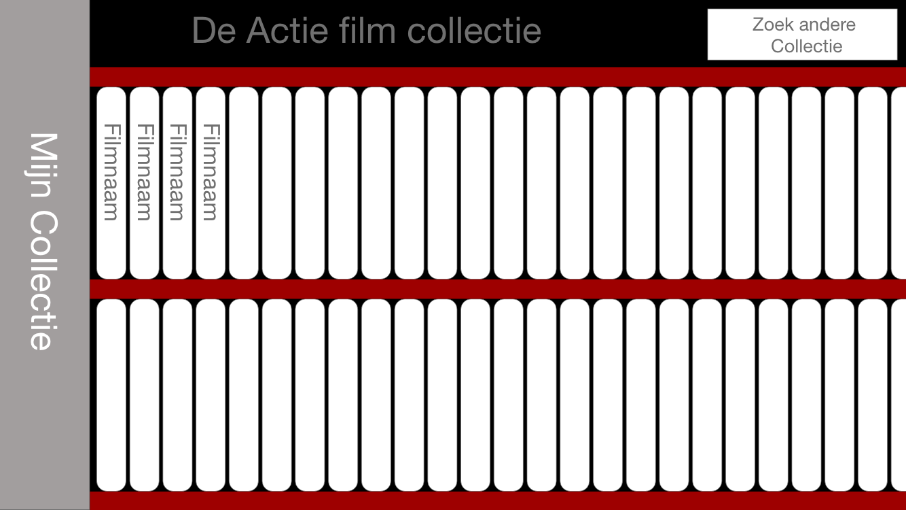
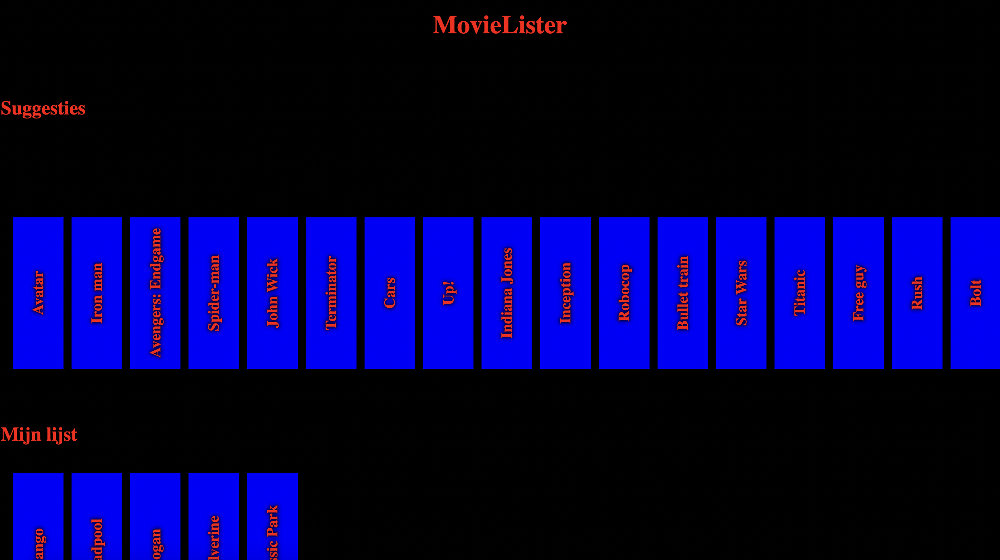
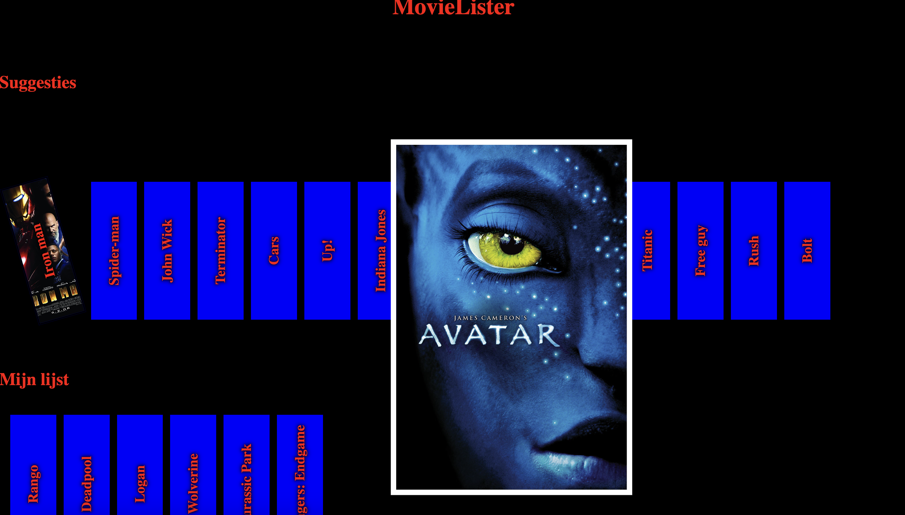
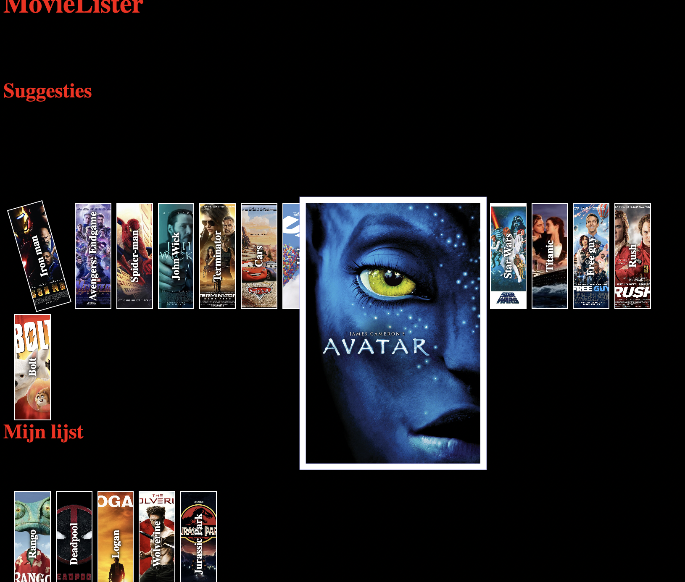

# Procesverslag
**Auteur:** -Ryan de Vries-

**De opdrachten:** [opdracht 1](opdracht1/index.html) en [opdracht 2](opdracht2/index.html)

Markdown is een simpele manier om HTML te schrijven.  
Markdown cheat cheet: [Hulp bij het schrijven van Markdown](https://github.com/adam-p/markdown-here/wiki/Markdown-Cheatsheet).

Nb. De standaardstructuur en de spartaanse opmaak van de README.md zijn helemaal prima. Het gaat om de inhoud van je procesverslag. Besteedt de tijd voor pracht en praal aan je website.

Nb. Door *open* toe te voegen aan een *details* element kun je deze standaard open zetten. Fijn om dat steeds voor de relevante stuk(ken) te doen.

## Bronnenlijst
  1. Mijn Broer
  2. Sanne
  3. ChatGPT
  4. Stackoverflow - Kan de link niet meer terug vinden

## Opdracht 1 plan

  
uitwerken na schetsen idee (voor week 2)

  ### Je storyboard:
  

  ### Je ambitie: 
  Aan deze technieken/punten wil ik werken:
  - KeyFrames
  - vormen zonder fotos maken
 

## Opdracht 1 reflectie

  
uitwerken bij afronden opdracht (voor week 4)

  ### Je uitkomst - karakteristiek screenshot(s):
  
  

  ### Dit ging goed/Heb ik geleerd: 
  Korte omschrijving met plaatje(s)
  Ik heb zelf een tennis ball kunnen maken en heb doormiddel van keyframes het logo tot leven kunnen brengen
  

  ### Dit was lastig/Is niet gelukt:
  Ik probeerde zelf nog een golfbal te maken maar deze heb ik niet mooi kunnen maken daardoor is het nu een witte bal geworden
  
  

## Opdracht 2 plan

  
uitwerken na schetsen idee (voor week 5)

  ### Je ontwerp:
  

  ### Je ambitie: 
  Aan deze technieken/punten wil ik werken:
  - Ik wil aan de slag gaan met dom manipulatie 
  - Ik wil met class toggle,add en remove gaan werken
  - ik wil de optie maken om iets in een andere lijst op te slaan
  - ...

## Opdracht 2 test

  
uitwerken na testen (week 7)

  Neem minimaal 5 bevindingen op:
  Het was niet duidelijk hoe je kon opslaan of verwijderen
  de animaties waren toepasseslijk
  Doordat je al gelijk de poster van de film ziet voelt het vergroten onnodig
  De ruimte die je moet aanklikken om het naar je eigen collectie te sturen is te klein
  Alles schuift veel heen en weer bij de animatie waardoor je aandacht veel verwijkt
  

  ### Bevinding 1:
  Omschrijving van wat er nog niet orde was (tekst en afbeeding(en)).
  
  Er is geen duidelijke omschrijven van hoe je de films opslaat in je eigen lijst.

  #### oplossing:
  Beschrijving hoe je het hebt hebt opgelost of als het niet gelukt is hoe je het zou oplossen (tekst en afbeeding(en)).
  
  De oplossing hiervoor zou zijn nog wat meer feedforward met bijvoorbeeld een pop up na de animatie alleen kreeg ik dat niet werkend

  ### Bevinding 3:
  Omschrijving van wat er nog niet orde was (tekst en afbeeding(en)).
  
  Het inzoomen voelde erg onnodig

  #### oplossing:
  Beschrijving hoe je het hebt hebt opgelost of als het niet gelukt is hoe je het zou oplossen (tekst en afbeeding(en)).
  
  Hiervoor een oplossing zou kunnen zijn extra info erbij te vermelden dat kreeg ik niet aan de praat. Dus heb ik bij de kleine versie gemaakt dat het op de rug van een film lijkt

 ### Bevinding 4:
  Omschrijving van wat er nog niet orde was (tekst en afbeeding(en)).
  
  De ruimte die je moet aan klikken om de film opteslaan is erg klein momenteel is het alleen de witte rand om de foto heen

  #### oplossing:
  Beschrijving hoe je het hebt hebt opgelost of als het niet gelukt is hoe je het zou oplossen (tekst en afbeeding(en)).
  
  Dit zou kunnen door met z-index de foto achter het li te zetten alleen na de animatie gaat de foto er niet meer achter en blijft deze ervoor desondanks de z-index erachter zou moeten bevinden

  ### Bevinding 5:
  Omschrijving van wat er nog niet orde was (tekst en afbeeding(en)).
  
  Er beweegt veel heen en weer waardoor je aandacht verwijkt na de animaties 

  #### oplossing:
  Beschrijving hoe je het hebt hebt opgelost of als het niet gelukt is hoe je het zou oplossen (tekst en afbeeding(en)).
  
  De oplossing hiervan zou de flip techniek zijn alleen na veel te proberen lukte het mij niet om het goed werkend te krijgen hierdoor schuift alles heen en weer

  

## Opdracht 2 reflectie

  
uitwerken bij afronden opdracht (voor week 8)

  ### Je uitkomst - karakteristiek screenshot(s):
  
  

  ### Dit ging goed/Heb ik geleerd: 
  Korte omschrijving met plaatje(s)
  
  Ik heb met animationend 2 animaties na elkaar laten lopen en zo een overgang gemaakt
  ik heb de dark mode en light mode werkend gekregen.

  

  ### Dit was lastig/Is niet gelukt:
  Korte omschrijving met plaatje(s)
  
  Het is me niet gelukt om na de animatie de hele li klikbaar te maken om het toe te voegen
  
  Het is me niet gelukt om tekst na voren te laten komen na de animatie om zo de bedoelingen duidelijk te maken voor de gebruiker
  
  

  

